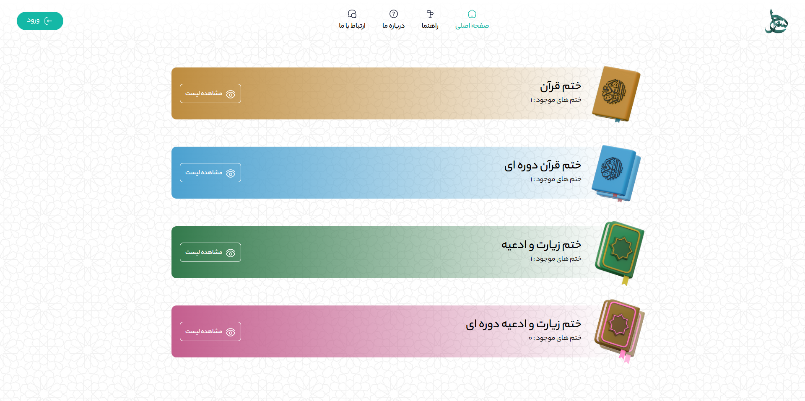

# Seraj App

<!-- overView -->
 

<!-- technology badge -->

## ✍ description

With this Farsi-language website, you can create a personalized daily recitation plan, participate in various recitation courses, and join a community of Quran and supplication enthusiasts. Developed using the latest web technologies, this platform offers an exceptional user experience. Our goal is to create a dynamic and beneficial spiritual space for everyone.

<h2> 📋 Table of Contents </h2>

- [Description](#✍-description)

- [Table of Contents](#📋-table-of-contents)

- [Demo](#👀-demo)

- [Developers](#👨‍💻-developers)

- [Contribute](#🤝-contributing)

- [Questions](#❓-questions)

- [Author](#😎-author)

- [License](#✅-license)

## 👀 Demo

[Live Preview](http://seraj-app.ir)

## 👨‍💻 Developers

* [M-AMIN-B](https://github.com/m-amin-b): Front-end developer at **Phoenix Group**
* ...

## 🤝 Contributing

Open an **_issue_** or a **_pull request_** to suggest changes or additions.

## ❓ Questions

[Open an Issue](https://github.com/m-amin-b/seraj/issues/new/) and let's chat!

## 😎 Author

[M-AMIN-B](https://github.com/m-amin-b)

## ✅ License
 
[MIT License](https://github.com/m-amin-b/seraj/blob/main/LICENSE)